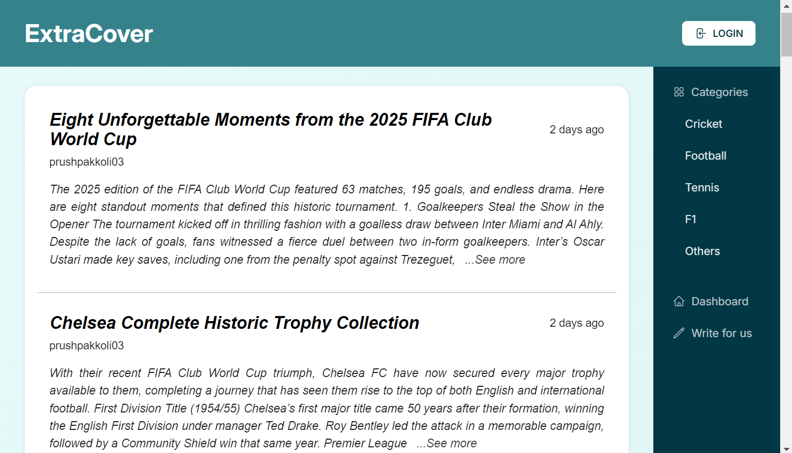
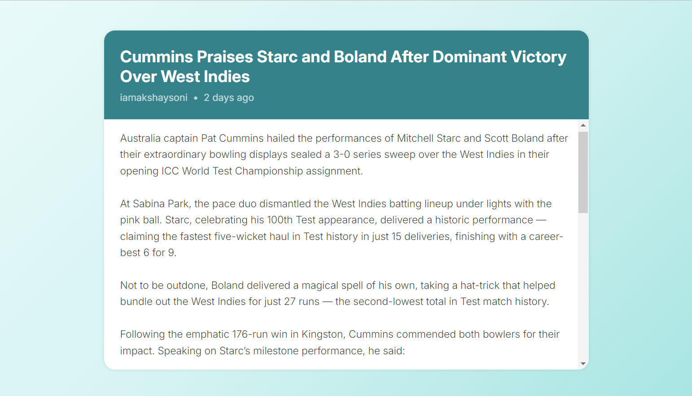
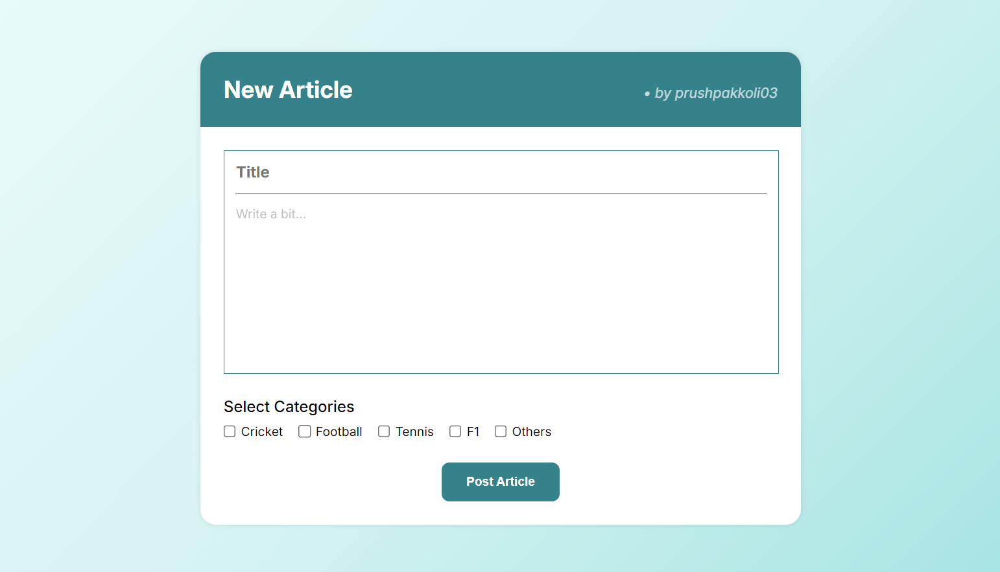

# ExtraCover

**ExtraCover** is a lightweight content management system (CMS) built using PHP and MySQLi. It allows authenticated admins to create, edit, and manage sports-related articles. The project is currently under development and is being adapted into a dedicated platform for publishing global sporting event updates and commentary.

<br>

## Preview




<br>

## Project Status
This is a **work-in-progress** version of ExtraCover.  
So far, it includes:
- Admin login/logout system
- Post creation, editing, and deletion
- Admin dashboard to manage articles
- Basic session and permission handling
- Designs for a few pages

The frontend is under development.

<br>

## Features Implemented (so far)
- Secure admin login with session handling
- Dashboard to view articles by logged-in admin
- Ability to create, edit, and delete articles
- Author-restricted access for post management

<br>

## Technologies Used
- PHP (Core Logic)
- MySQLi (Database interaction)
- HTML & basic CSS
- MySQL (Database)

<br>

## Database Schema

### Table: `users`
Stores admin user credentials.

```sql
CREATE TABLE users (
    id INT AUTO_INCREMENT PRIMARY KEY,
    username VARCHAR(50) UNIQUE NOT NULL,
    name VARCHAR(50) NOT NULL,
    password VARCHAR(255) NOT NULL
);
```

### Table: `posts`
Stores articles.

```sql
CREATE TABLE posts (
    id INT AUTO_INCREMENT PRIMARY KEY,
    title VARCHAR(255) NOT NULL,
    content TEXT NOT NULL,
    created_at DATETIME DEFAULT CURRENT_TIMESTAMP,
    author_id INT NOT NULL
);
```
